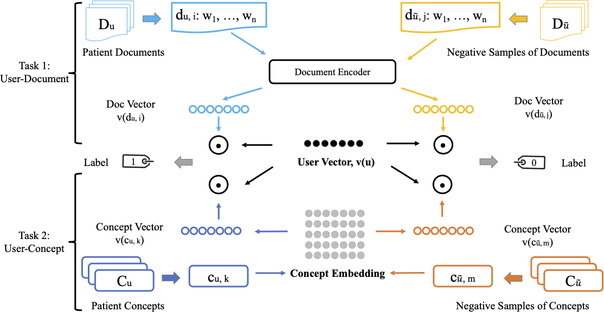
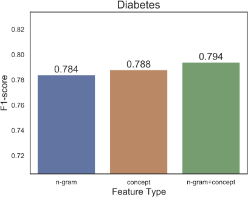
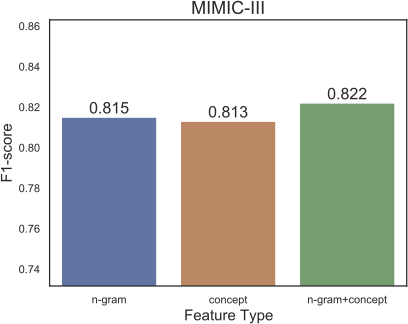

# UserEmb_Explainable

# Model Diagram



# Runtime Platform

* OS: Ubuntu 20.04
* Python 3.8
* Java JDK 1.8
* CUDA 11
* PyTorch 1.7.1+cu110


# Data Acquisite

In this work, we have used two clinical narrative data, diabestes and MIMIC-III. Both datasets require you to take a list of training courses before acquiring the dataset.
This will ensure you follow basic ethic rules to use the datasets. The datasets should be used for ***research purposes only***.
* Diabetes
    * This dataset contains a list of candidates for clinical corhort selection. Each user/patient has multiple clinical narratives.
    * Each user/patient suffers diabetes.
    * Download 2018 (Track 1) Clinical Trial Cohort Selection Challenge: https://portal.dbmi.hms.harvard.edu/projects/n2c2-nlp/
* MIMIC-III
    * This dataset contains ICU records from a hospital. 
    * Each user per visit will generate a list of clincal records.
    * Download data, MIMIC-III Clinical Database: https://physionet.org/content/mimiciii/1.4/

# Prerequisite

* Download and follow instructions in the [MetaMap](https://metamap.nlm.nih.gov/MetaMap.shtml) to setup MetaMap.
    * Follow the instructions to download both data (dictionaries) and metamap toolkit.
    * If you have not installed Java, please install and following the [JAVA link](https://www.oracle.com/java/technologies/javase/javase-jdk8-downloads.html).
    * Note that our code supports both MetaMap and MetaMap-lite (faster version), but you have to change by yourself in `data_builder.py`.
* Python MetaMap Interface
    * You will install [PyMetaMap toolkit](https://github.com/AnthonyMRios/pymetamap).
    * Basically, the toolkit is a subprocess communicator between your Python script and Java files.
    * But our `data_builder.py` has its built-in supports, but you have to change codes by yourself using `metamap_concepts` or `metamaplite_concepts`.
* Other dependencies
    * Install [PyTorch](https://pytorch.org/get-started/locally/)

# Data Analysis
Data analysis scripts will be under the folder of `data`. 
We probe data via two types of analysis aspects, records and concepts.

Diabetes Analysis             |  Mimic-III Analysis
:-------------------------:|:-------------------------:
  |  

# Experimental Steps

1. Data Preprocessing
    * Be sure to change data directory before running: 
        * `python data_builder.py`;
    * For the mimic-iii data, you have to change the mimic-iii to your own path;
    * For the diabetes data, first, you need to put both training and testing cases into one directory,
      in our case, we named the directory as `all`;
    * Then go to the `data` directory and run the following lines:
      * `python data_analyzer.py`;
      * `python concept_analyzer.py`;
      * The two scripts will generate necessary data stats and concept vocabularies for training models.
2. Baselines
    * All baseline models will be under the directory of `./baselines/`;
    * Run `python any_baseline_script.py data_name` will start to train user embeddings:
      * dp2user: `python deep_patient2016.py diabetes` or `python deep_patient2016.py mimic-iii`;
      * word2user: `python word2user.py diabetes` or `python word2user.py mimic-iii`;
3. Our approach
    * Run the following script will create entity augmented user representations;
      * We provide a list of running commands in shell scripts;
        * Go to the jobs folder: `cd ./jobs`;
        * To train CAUE_GRU for diabetes: `sh run_gru_diabetes.sh`;
        * To train CAUE_GRU for MIMIC-III: `sh run_gru_mimic.sh`.

# Contact

Xiaolei Huang, **xiaolei.huang@memphis.edu**


# Citation
```
@inproceedings{huang2022enriching,
    author = {Huang, Xiaolei and Dernoncourt, Franck and Dredze, Mark},
    title = {Enriching Unsupervised User Embedding via Medical Concepts},
    year = {2022},
    publisher = {Association for Computing Machinery},
    address = {New York, NY, USA},
    booktitle = {Proceedings of the Conference on Health, Inference, and Learning},
    pages = {1–16},
    keywords = {Electronic Health Records, Natural Language Processing, Patient Generated Health Data, Representation Learning, Unsupervised Learning},
    location = {Virtual Event, USA},
    series = {CHIL '22}
}
```
